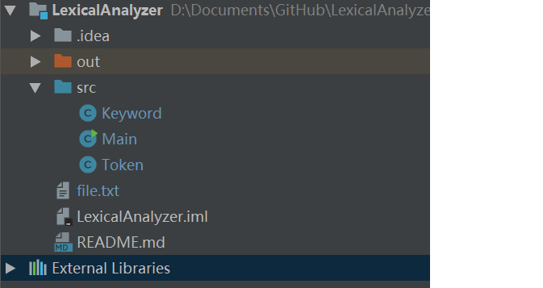
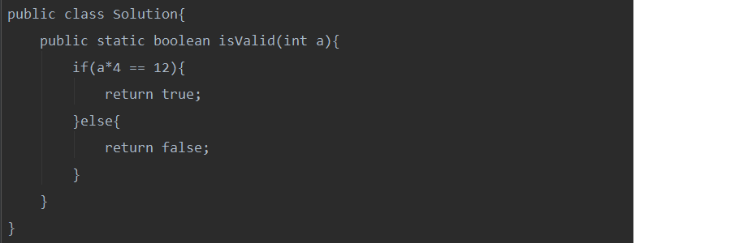
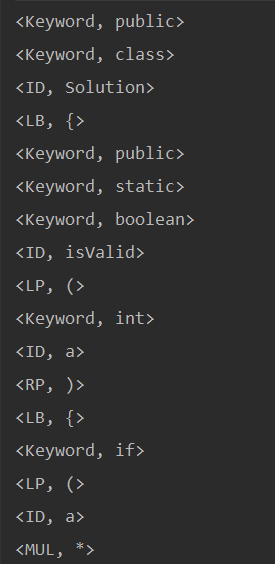
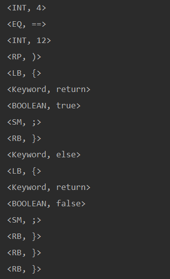

## Lab1 词法分析器

词法分析器的输入：

file.txt文件，其内容是类Java语言。

词法分析器的输出：

Token串：\<Token类型，字符串>

关键字

（Token类型：Keyword)

public	private	class	while	do		if		void		try		catch

else		return	static	int		float	boolean

特殊字符

| 特殊字符 | Token类型 |
| ---- | ------- |
| {    | LB      |
| }    | RB      |
| (    | LP      |
| )    | RP      |
| +    | ADD     |
| -    | SUB     |
| *    | MUL     |
| /    | DIV     |
| %    | MOD     |
| =    | ASSIGN  |
| ;    | SM      |
| ,    | CM      |
| >    | GT      |
| <    | LT      |
| ==   | EQ      |
| !=   | NE      |

正则表达式

| 字符串      | 表达式                | Token类型 |
| -------- | ------------------ | ------- |
| int型数据   | d+     注：(d=[0-9]) | INT     |
| float型数据 | d\*\.?d+           | FLOAT   |
| boolean值 | true\|false        | BOOLEAN |

项目结构

file.txt即为读入文件，分析结果打印在控制台上。

实例：

输入文件内容：

输出结果：

 

